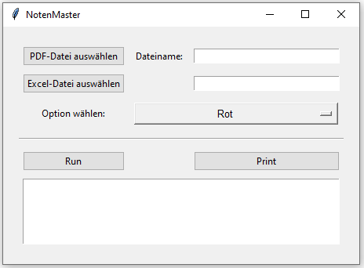

# NotenMaster

## Overview

The Orchestral Sheet Music Splitter is a program designed to assist orchestras in organizing and splitting a large PDF file containing multiple sheet music parts into individual parts for each instrument and voice. The program uses information provided in an Excel file to determine the corresponding page numbers for each instrument and voice.

## Features
- PDF and Excel Selection: The user can select the large PDF file and the corresponding Excel file through a user-friendly GUI.
- Output Organization: After selecting a destination folder, the program creates a main folder named after the song title, with subfolders for each instrument containing their respective sheet music pages.
- Print Function: The program can generate a large print-ready PDF file. The number of copies for each part is taken from the "Print Count" column in the Excel file.
- Excel Template: A template of the required Excel file format is included in the repository.

## How it works
1. **Input Files:** The user selects the large PDF containing all the sheet music parts and an Excel file that lists each instrument and voice with their corresponding page numbers.
2. **Run the Program:** Upon clicking the "Run" button, the user is prompted to select a destination folder for the output.
3. **File Generation:** The program processes the PDF and Excel files, creating a main folder named after the song title. Inside this folder, it creates subfolders for each instrument, splitting the PDF into individual parts and saving them in their respective subfolders.
4. **Print PDF:** Optionally, the program can generate a single PDF file for printing, with the number of copies specified in the Excel file.

## Usage
1. **Prepare Excel File:** Use the provided template to list each instrument and voice along with their corresponding page numbers in the PDF.
2. **Start the Program:** Either run `main.py` or use the bash file `start.bat` to execute it. If you are using the `start.bat` you have to adapt the conda env.
3. **Select Files:** Through the GUI, select the large PDF file and the prepared Excel file.
4. **Choose Destination:** After clicking the "Run" button, select a folder where the output should be saved.
5. **Generate Output:** The program will create the necessary folders and split the PDF accordingly. If the print function is used, it will also generate a print-ready PDF file.

## Example
1. **Excel Template:** The provided template should be filled with the instrument names, corresponding page numbers, and print count.
2. **GUI Interaction:** Select the PDF and Excel files using the GUI, then specify the output folder.
3. **Output Structure:**
```python
Song_Title/
├── Violin/
│   ├── page1.pdf
│   ├── page2.pdf
│   └── ...
├── Flute/
│   ├── page5.pdf
│   ├── page6.pdf
│   └── ...
└── ...
```
4. **Print PDF:** A single PDF file with all parts, with the number of copies specified in the Excel file.

## Installation
Clone the Repository
```bash
git clone https://github.com/your-repo/orchestral-sheet-music-splitter.git
```

Create conda env with requirements.txt
```bash
conda create --name <env> --file requirements.txt
```
## GUI

